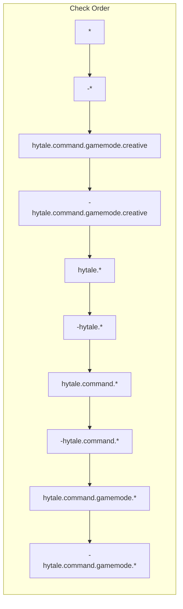
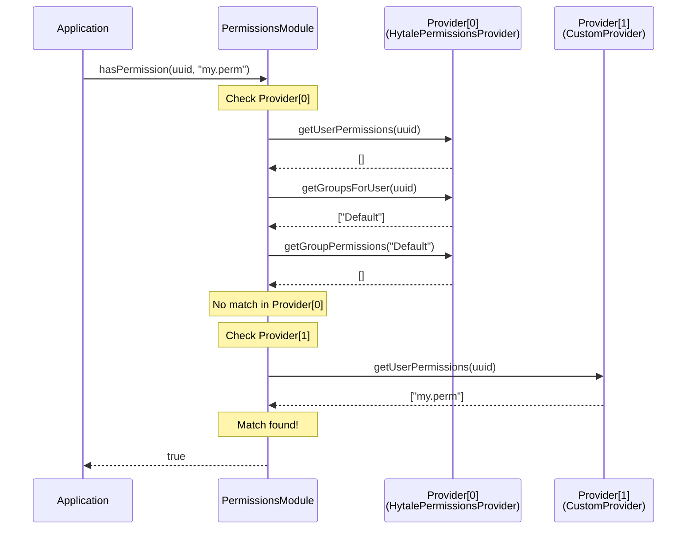

# Permission Resolution Flowchart

Visual representation of how `PermissionsModule.hasPermission()` resolves permissions.

---

## Main Resolution Flow

```mermaid
flowchart TD
    START([hasPermission&#40;uuid, permId, default&#41;]) --> PROVIDER_LOOP

    subgraph PROVIDER_LOOP["For Each Provider"]
        P1[Get Provider] --> USER_CHECK

        subgraph USER_CHECK["Check User Permissions"]
            U1[Get userNodes = provider.getUserPermissions&#40;uuid&#41;] --> U2{checkNodes&#40;userNodes, permId&#41;}
            U2 -->|TRUE| RETURN_TRUE([Return TRUE])
            U2 -->|FALSE| RETURN_FALSE([Return FALSE])
            U2 -->|NULL| GROUP_LOOP
        end

        subgraph GROUP_LOOP["For Each Group User Belongs To"]
            G1[Get group from provider.getGroupsForUser&#40;uuid&#41;] --> G2[Get groupNodes = provider.getGroupPermissions&#40;group&#41;]
            G2 --> G3{checkNodes&#40;groupNodes, permId&#41;}
            G3 -->|TRUE| RETURN_TRUE
            G3 -->|FALSE| RETURN_FALSE
            G3 -->|NULL| VIRTUAL_CHECK

            subgraph VIRTUAL_CHECK["Check Virtual Groups"]
                V1[Get virtualNodes = virtualGroups.get&#40;group&#41;] --> V2{checkNodes&#40;virtualNodes, permId&#41;}
                V2 -->|TRUE| RETURN_TRUE
                V2 -->|FALSE| RETURN_FALSE
                V2 -->|NULL| NEXT_GROUP{More Groups?}
            end

            NEXT_GROUP -->|Yes| G1
            NEXT_GROUP -->|No| NEXT_PROVIDER{More Providers?}
        end

        NEXT_PROVIDER -->|Yes| P1
        NEXT_PROVIDER -->|No| RETURN_DEFAULT([Return default value])
    end

    style RETURN_TRUE fill:#4CAF50,color:#fff
    style RETURN_FALSE fill:#f44336,color:#fff
    style RETURN_DEFAULT fill:#9E9E9E,color:#fff
```



---

## Node Checking Algorithm (checkNodes)

```mermaid
flowchart TD
    START([checkNodes&#40;nodes, id&#41;]) --> NULL_CHECK{nodes == null?}

    NULL_CHECK -->|Yes| RETURN_NULL([Return NULL])
    NULL_CHECK -->|No| GLOBAL_GRANT

    GLOBAL_GRANT{nodes contains '*'?} -->|Yes| RETURN_TRUE([Return TRUE])
    GLOBAL_GRANT -->|No| GLOBAL_DENY

    GLOBAL_DENY{nodes contains '-*'?} -->|Yes| RETURN_FALSE([Return FALSE])
    GLOBAL_DENY -->|No| EXACT_GRANT

    EXACT_GRANT{nodes contains id?} -->|Yes| RETURN_TRUE
    EXACT_GRANT -->|No| EXACT_DENY

    EXACT_DENY{nodes contains '-' + id?} -->|Yes| RETURN_FALSE
    EXACT_DENY -->|No| WILDCARD_LOOP

    subgraph WILDCARD_LOOP["Check Prefix Wildcards (shorter prefixes first)"]
        W1["Split id by '.'<br>e.g., 'hytale.command.ban' → ['hytale','command','ban']"] --> W2["Build prefix trace incrementally:<br>i=0: 'hytale', i=1: 'hytale.command', i=2: 'hytale.command.ban'"]
        W2 --> W3{nodes contains trace + '.*'?}
        W3 -->|Yes| RETURN_TRUE
        W3 -->|No| W4{nodes contains '-' + trace + '.*'?}
        W4 -->|Yes| RETURN_FALSE
        W4 -->|No| W5{More segments?}
        W5 -->|Yes| W2
        W5 -->|No| RETURN_NULL
    end

    style RETURN_TRUE fill:#4CAF50,color:#fff
    style RETURN_FALSE fill:#f44336,color:#fff
    style RETURN_NULL fill:#9E9E9E,color:#fff
```



---

## Wildcard Resolution Example

For permission `hytale.command.gamemode.creative`:



**First match wins.** If `hytale.command.*` is found before `-hytale.command.gamemode.*`, permission is GRANTED.

---

## Provider Chain Example



---

## Resolution Priority Table

| Priority | Check | Example |
|----------|-------|---------|
| 1 | Provider[0] User Direct | `userPerms.contains("my.perm")` |
| 2 | Provider[0] Group[0] | `group0Perms.contains("my.perm")` |
| 3 | Provider[0] Group[0] Virtual | `virtualGroups.get("Creative")` |
| 4 | Provider[0] Group[1] | (next group) |
| ... | ... | ... |
| N | Provider[1] User Direct | (next provider) |
| N+1 | Provider[1] Group[0] | ... |
| Last | Default Value | `false` (or specified default) |

---

## Decision Tree Summary

```
hasPermission(uuid, "a.b.c", false)
│
├── Provider[0]
│   ├── User Permissions: [check *, -*, a.b.c, -a.b.c, a.*, a.b.*]
│   │   └── No match? Continue...
│   │
│   ├── Group "Admin" Permissions: [check same patterns]
│   │   └── No match? Continue...
│   │
│   ├── Group "Admin" Virtual: [check same patterns]
│   │   └── No match? Continue...
│   │
│   └── Group "Default" Permissions: [check same patterns]
│       └── No match? Continue...
│
├── Provider[1] (if exists)
│   └── (same checks)
│
└── Return default (false)
```

---

## Null vs Empty Set Semantics

| Input | Behavior | Code Path |
|-------|----------|-----------|
| `null` set | Skip immediately (fall through) | `checkNodes()` returns `null` at first check |
| Empty set `[]` | Check all patterns, find no matches | `checkNodes()` returns `null` after exhausting all checks |

Both `null` and empty sets result in a fall-through to the next check level, but via different code paths. A `null` set means the provider has no data at all; an empty set means the provider has data but no permissions are assigned.

---

## Key Takeaways

1. **First match wins** - Once permission is granted or denied, checking stops
2. **Denial is explicit** - Must use `-` prefix to deny
3. **Wildcards are hierarchical** - `a.*` matches `a.b` but not `x.y`; shorter prefixes are checked first (`hytale.*` before `hytale.command.*`)
4. **Providers are additive** - All providers are checked; first match from any provider wins
5. **Virtual groups extend regular groups** - Checked after group's own permissions

---

*See [PERMISSIONS_SYSTEM.md](../PERMISSIONS_SYSTEM.md) for complete documentation*
